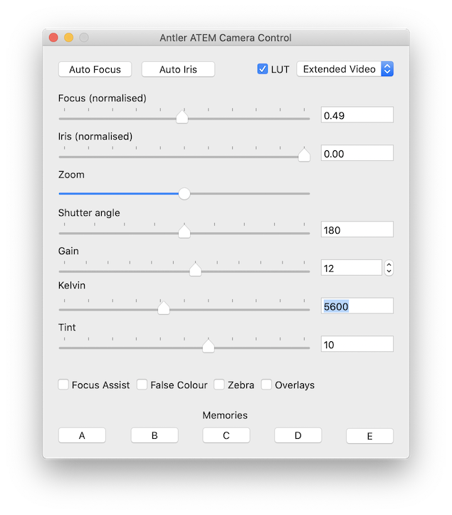
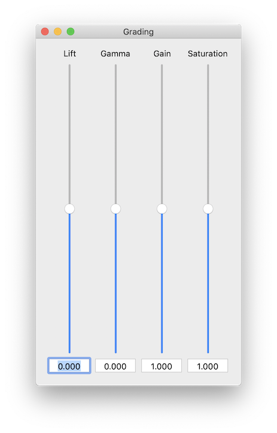
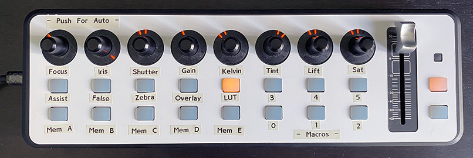

# ATEM-camera-control
A simple app to control a Blackmagic camera via an ATEM switcher

Tested only with my ATEM Mini and Pocket Cinema Camera 4K

## Notes:

* This is just a simple experiment for my own amusement. You may use it freely, but it comes with no guarantees whatsoever!

* Pressing and holding any of the ***Memory*** buttons at the bottom for three seconds stores the current settings.

* Pressing one momentarily restores the settings.

* The ***Grading*** window settings were not included in stored memories in v1.0. This is added in v1.0.1. 

* There is no feedback from the camera to the app. Therefore using the ***Auto Iris*** or ***Auto Focus*** buttons will put the focus and iris sliders out of sync with the camera.

* The LUT controls have no effect. At least not on my camera. It seems that is not implemented on the Pocket 4K. Perhaps it works on other cameras.

* Version 1.0.3b1 includes the addition of some crude MIDI control. This is implemented by copying and pasting blocks of code from the [MIKMIDI](https://github.com/mixedinkey-opensource/MIKMIDI) samples, and hacking at them until it works. It is in no way robust, and probably includes code that is unnecessary but I have copied across because I did not understand what it did. It is also currently hard coded to my own setup which is a Behringer X-Touch Mini, which shows up as the third MIDI device (after Network and Bluetooth). Unless your setup is identical to mine, MIDI control will probably not work without altering the code.

## About
* The main application code is Copyright (c) 2021 Antler Post

* The ATEM Switcher SDK is Copyright (c) 2020 Blackmagic Design

* MIKMIDI is Copyright (c) 2013 Mixed In Key, LLC. 

* This software is released under the terms of New BSD License: [https://opensource.org/licenses/BSD-3-Clause](https://opensource.org/licenses/BSD-3-Clause)